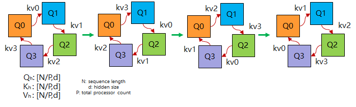
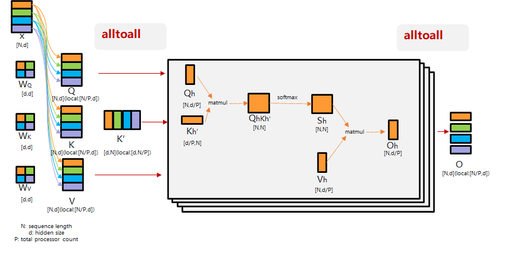

# 多卡并行

MindIE SD 提供多种并行策略来解决单卡显存不足和推理速度瓶颈的问题，不同策略从不同维度对计算和显存进行拆分：

- **张量并行（Tensor Parallel）**：沿权重矩阵的行或列切分，将矩阵计算分布到多卡，适合隐藏层维度较大的模型。
- **环状序列并行（Ring Sequence Parallel）**：沿序列维度切分 Q，以环状通信在设备间传递 KV，通过计算掩盖通信开销。
- **Ulysses 序列并行（Ulysses Sequence Parallel）**：沿序列维度切分输入，通过 AlltoAll 在注意力头维度重组，各卡并行计算不同注意力头。
- **CFG 并行（CFG Parallel）**：将正样本和负样本推理分发到不同设备并行执行，适合使用 Classifier-Free Guidance 的扩散模型。

各策略可以独立使用，也可以组合叠加，具体支持情况请参见 [supported_matrix.md](supported_matrix.md)。

**推荐方案：**

- **张量并行（TP）**：可以有效降低显存，但通信开销较大，不推荐优先使用。
- **Ulysses 序列并行（USP）**：通信开销小，推荐优先使用。约束：Ulysses 的并行度需要能被 FA 的 head num 整除。
- **环状序列并行（RSP）**：可以配合 Ulysses 使用，补充 Ulysses 无法被 head num 整除的部分。
- **CFG 并行**：通信开销小，当模型的 CFG 大于 1 时，推荐使用。

## Tensor Parallel

随着模型规模的扩大，单卡显存容量无法满足大模型的需求。张量并行会将模型的张量计算（如矩阵乘法、卷积等）分散到多个设备上并行执行 ，从而降低单个设备的内存和计算负载。本章节以一次矩阵乘法为例，介绍张量并行的原理。

假如输入数据为X，参数为W，X的维度 = (b, s, h)，W的维度 = (h, h')，一次矩阵乘法如下图所示。其中：

- b：batch_size，表示批次大小。
- s：sequence_length，表示输入序列的长度。
- h：hidden_size，表示每个token向量的维度。
- h'：参数W的hidden_size。


优化方法分为以下两种：

- 按行切分：按照权重W的行切分，以N=2为例，将矩阵按照虚线切分。

    

    下图展示了切分后的结果，从一个矩阵乘转换为两个矩阵乘，分别在不同的NPU上运算，通过卡间通信将各个结果进行加法运算得到完整结果。

    

- 按列切分：按照权重W的列切分，以N=2为例，将矩阵按照虚线切分。

    

    下图展示了切分后的结果，从一个矩阵乘转换为两个矩阵乘，分别在不同的NPU上运算，通过卡间通信将各个结果进行拼接得到完整结果。

    

### 代码示例

以下示例展示了分布式初始化及张量并行的基本用法：

```python
import os
import torch
import torch.distributed as dist
import torch_npu

# 1. 初始化分布式环境
dist.init_process_group(backend="hccl")
torch.npu.set_device(f"npu:{os.environ['LOCAL_RANK']}")

# 2. 定义原始线性层
linear = torch.nn.Linear(4096, 4096).npu()
x = torch.randn(1, 256, 4096, device="npu")

# 3. 按列切分：每个 rank 持有 W 的一半列
#    前向后通过 all-reduce 通信合并结果
world_size = dist.get_world_size()
rank = dist.get_rank()

with torch.no_grad():
    # 切分权重：每个 rank 持有 W[:, h//world_size * rank : h//world_size * (rank+1)]
    w_chunk = linear.weight.data.chunk(world_size, dim=0)[rank]
    # 本地矩阵乘
    local_out = x @ w_chunk.T
    # all-reduce 合并各 rank 结果
    dist.all_reduce(local_out)

print(f"Rank {rank} output shape: {local_out.shape}")
```

### 通信方式

列切分时各设备独立计算本地矩阵乘后通过 all-reduce 合并结果；行切分时各设备计算完整结果的分片，通过 all-gather 拼接完整输出。通信量与 hidden_size 成正比，设备间带宽充足时通信开销占比随模型增大而降低。

### 适用场景

适合隐藏层维度（hidden_size）较大的模型，当单卡显存不足以容纳完整权重矩阵时尤为有效。TP 依赖高带宽卡间通信（如 HCCS），建议仅在单机多卡范围内使用，TP degree 不应超过单机 NPU 数量。

---

## Ring Sequence Parallel

### 原理

将 Q 切分到各设备，计算时各设备计算完当前 KV 对后，将持有的 KV 对发送给下一设备，并继续接收前一设备的 KV 对，形成一个环状的通信结构。当卡间通信时间 ≤ 计算时间时，通信开销可被计算掩盖。



### 通信方式

采用 P2P（点对点）通信。设备 i 完成当前步的注意力计算后，将自己的 KV 发送给设备 i+1，同时从设备 i-1 接收新的 KV。经过 N 轮通信后，所有设备完成全部序列位置的注意力计算。当计算耗时大于通信耗时（即序列较长、head_dim 较大）时，通信开销可被计算完全掩盖。

### 适用场景

适用于序列长度远大于 head_dim 的长序列场景。当设备间 P2P 带宽充裕（如同机 NPU）时效果最佳。不适用于短序列场景，此时通信开销占比过高。

### 使用示例

```python
import torch
import torch.distributed as dist

dist.init_process_group(backend="hccl")
rank = dist.get_rank()
world_size = dist.get_world_size()

batch, seqlen, head, dim = 1, 4096, 8, 128
seqlen_chunk = seqlen // world_size

# 各设备持有自己的 Q/K/V 分片
q_chunk = torch.randn(batch, seqlen_chunk, head, dim).npu()
k_chunk = torch.randn(batch, seqlen_chunk, head, dim).npu()
v_chunk = torch.randn(batch, seqlen_chunk, head, dim).npu()

def local_attn(q, k, v):
    score = (q @ k.transpose(-2, -1)) / (dim ** 0.5)
    return score.softmax(dim=-1) @ v

# 第一轮：计算自身的 KV
out = local_attn(q_chunk, k_chunk, v_chunk)

# 后续轮次：环形传递 KV
for step in range(1, world_size):
    send_rank = (rank + 1) % world_size
    recv_rank = (rank - 1 + world_size) % world_size
    k_recv = torch.empty_like(k_chunk)
    v_recv = torch.empty_like(v_chunk)
    dist.send_recv(k_chunk, k_recv, send=send_rank, recv=recv_rank)
    dist.send_recv(v_chunk, v_recv, send=send_rank, recv=recv_rank)
    k_chunk, v_chunk = k_recv, v_recv
    out += local_attn(q_chunk, k_chunk, v_chunk)
```

---

## Ulysses Sequence Parallel

### 原理

把每个样本在序列维度上进行分割，分配给不同设备。在进行注意力计算之前，对分割后的Q、K和V进行AlltoAll。各设备和其他所有设备交换信息，每个设备都能收到注意力头的非重叠子集。各设备并行计算不同注意力头，计算后再通过AlltoAll收集计算结果。



### 通信方式

核心采用 AlltoAll 集体通信。每个设备在注意力计算前将自己的序列分块发送给所有其他设备，同时接收其他设备的序列分块，在注意力头维度完成数据重组。计算完成后再次通过 AlltoAll 将结果按序列维度收集回来。当序列长度和设备数同比例增加时，单设备通信量保持恒定（理论分析见 DeepSpeed Ulysses 论文）。

### 适用场景

适合注意力头数较多、AlltoAll 带宽充裕的场景。相比 RSP，Ulysses 在短序列多头场景下效率更高，特别适用于序列长度与 hidden_size 均较大的情况。

- 未使用Ulysses Sequence Parallel样例：

    ```python
    import torch
    import torch_npu
    from mindiesd import attention_forward
    torch.npu.set_device(0)
    batch, seqlen, hiddensize = 1, 4096, 512
    head = 8
    x = torch.randn(batch, seqlen, hiddensize, dtype=torch.float16).npu()
    x = x.reshape(batch, seqlen, head, -1)
    out = attention_forward(x, x, x, opt_mode="manual", op_type="prompt_flash_attn", layout="BSND")
    x = out.reshape(batch, seqlen, hiddensize)
    ```

- 使用Ulysses Sequence Parallel样例：

    ```python
    import os
    import torch
    import torch.distributed as dist
    import torch_npu
    from mindiesd import attention_forward

    batch, seqlen, hiddensize = 1, 4096, 512
    head = 8
    x = torch.randn(batch, seqlen, hiddensize, dtype=torch.float16).npu()

    def init_distributed(
        world_size: int = -1,
        rank: int = -1,
        distributed_init_method: str = "env://",
        local_rank: int = -1,
        backend: str = "hccl"
    ):
        dist.init_process_group(
            backend=backend,
            init_method=distributed_init_method,
            world_size=world_size,
            rank=rank,
        )
        torch.npu.set_device(f"npu:{os.environ['LOCAL_RANK']}")
    # 1、初始化分布式环境
    world_size = int(os.environ["WORLD_SIZE"])
    rank = int(os.environ["LOCAL_RANK"])
    init_distributed(world_size, rank)

    # 2、对seqlen维度按照world_size进行切分
    x = torch.chunk(x, world_size, dim=1)[rank] # 序列切分
    seqlen_chunk = x.shape[1]
    x = x.reshape(batch, seqlen_chunk, head, -1)

    # 3、调用all_to_all使能ulysess并行
    in_list =  [t.contiguous() for t in torch.tensor_split(x, world_size, 2)]
    output_list = [torch.empty_like(in_list[0]) for _ in range(world_size)]
    dist.all_to_all(output_list, in_list)
    x = torch.cat(output_list, dim=1).contiguous()
    att_out = attention_forward(x, x, x, opt_mode="manual", op_type="prompt_flash_attn", layout="BSND")
    in_list =  [t.contiguous() for t in torch.tensor_split(att_out, world_size, 1)]
    output_list = [torch.empty_like(in_list[0]) for _ in range(world_size)]
    dist.all_to_all(output_list, in_list)
    x = torch.cat(output_list, dim=2).contiguous()
    x = x.reshape(batch, seqlen_chunk, hiddensize)

    # 4、对seqlen维度进行all_gather操作
    output_list = [torch.empty_like(x) for _ in range(world_size)]
    dist.all_gather(output_list, x)
    x = torch.cat(output_list, dim=1)
    ```

---

## CFG Parallel

### 原理

对于一个带噪声的图像和文本提示词，模型需要执行两次推理，分别计算正样本和负样本，该计算过程为串行过程，导致每个去噪步骤都需要两次前向传播，增加了推理时间。CFG 并行可以将正样本和负样本分别在不同的设备上计算，将两次串行计算合并为一次并行计算，显著提升推理速度。


### 通信方式

正负样本计算完全独立，各设备无需中间通信。计算完成后通过 all-gather 收集两个结果，或者在各自设备上直接使用自身计算结果。通信量极小，近似为零开销并行。

### 适用场景

适用于使用 CFG（guidance_scale > 1）的扩散模型推理场景，且至少拥有 2 卡富余设备。设备越多，加速越接近 2×。如果设备紧张，优先将资源分配给 TP 或序列并行。

### 使用示例

```python
import os
import torch
import torch.distributed as dist

dist.init_process_group(backend="hccl")
torch.npu.set_device(f"npu:{os.environ['LOCAL_RANK']}")

rank = dist.get_rank()
guidance_scale = 7.5

# rank 0 算负样本（unconditioned），rank 1 算正样本（conditioned）
if rank == 0:
    noise_pred_uncond = model(latent, timestep, uncond_embed)
    output = noise_pred_uncond
elif rank == 1:
    noise_pred_cond = model(latent, timestep, cond_embed)
    output = noise_pred_cond

# all-gather 交换结果
output_list = [torch.empty_like(output) for _ in range(world_size)]
dist.all_gather(output_list, output)

# CFG 融合
noise_pred = output_list[0] + guidance_scale * (output_list[1] - output_list[0])
```

### 补充内容 —— CFG 融合

CFG 融合是另一种优化思路：不在设备间并行，而是在单设备内将正样本和负样本在 batch 维度拼接后送入模型，使一次前向计算同时产出两个结果，算子调用次数减半。

与 CFG 并行相比，CFG 融合不消耗额外的设备资源，适合设备数有限但希望降低单次推理延迟的场景。两者可根据硬件条件选择使用。


