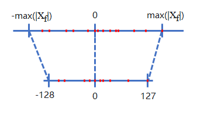

# 量化

MindIE SD 提供两类量化能力，分别作用于模型的不同部分：

- **Linear 量化**：对线性层的权重和激活值进行低比特处理（INT8/FP8/W8A16 等），减少模型存储空间和计算开销。
- **FA 量化**：对注意力计算中的 Q/K/V 激活值进行 FP8 块量化，降低注意力计算的显存带宽需求。

以下两节分别介绍两种量化的原理和使用方法。

## Linear量化

### 通用原理

量化是将模型的权重（weight）和激活值（activation）从高精度（如 FP32）映射到低精度（如 INT8、FP8）的过程。低精度计算可以减少显存占用和带宽需求，提升推理吞吐。

量化根据是否需要重训练，分为训练后量化（Post-Training Quantization, PTQ）和量化感知训练（Quantization-Aware Training，QAT）。本章节以 PTQ 量化为主，主要分为以下三种类型：

- **动态量化**：仅离线量化权重，在推理时动态计算激活值的量化因子。
- **静态量化**：权重和激活值都是离线量化。
- **Time-Aware 量化**：根据时间维度动态调整量化策略。

下图展示了 INT8 量化示例，将 FP32 映射到 INT8。其中 `[-max(xf), max(xf)]` 是量化前浮点范围，`[-128, 127]` 是量化后范围。



### 技术特点

本仓库通过 `quantize` 接口统一处理 Linear 量化，支持以下算法。

**权重量化**（仅量化权重，激活值保持原始精度）：

| 算法 | 权重精度 | 说明 |
|------|----------|------|
| W8A16 | INT8 | 基础权重量化 |
| W4A16 | INT4 | 更高压缩比 |
| W4A16_AWQ | INT4 + AWQ | 激活感知的权重量化 |
| W8A16_GPTQ | INT8 + GPTQ | 基于 GPTQ 后训练的权重量化 |
| W4A16_GPTQ | INT4 + GPTQ | 同上，INT4 版本 |

**权重激活量化**（权重和激活值均量化，计算在低精度下完成）：

| 算法 | 量化粒度 | 说明 |
|------|----------|------|
| W8A8 | 逐层 | 基础 INT8 权重激活量化 |
| W8A8_TIMESTEP | 逐层 + 时间步 | 推理中动态切换量化策略 |
| W8A8_DYNAMIC | 逐层 | 激活值动态量化 |
| W8A8_PER_CHANNEL | 逐通道 | 按通道粒度量化 |
| W8A8_PER_TENSOR | 逐张量 | 按张量粒度量化 |
| W8A8_MXFP8 | 逐层 | MXFP8 格式量化 |
| W4A4_DYNAMIC | 逐 token + 逐通道 | INT4 权重激活量化 |
| W4A4_MXFP4_SVD | 逐层 | MXFP4 格式量化 |
| W4A4_MXFP4_DUALSCALE | 逐层 | MXFP4 双尺度量化 |
| W4A4_MXFP4_DYNAMIC | 逐 token + 逐通道 | MXFP4 动态量化 |

### 接口和使用

所有 Linear 量化算法通过 `quantize` 接口统一触发。

```python
from mindiesd import quantize
```

#### 参数说明

| 参数 | 类型 | 必选 | 默认值 | 说明 |
|------|------|------|--------|------|
| `model` | `nn.Module` | 是 | - | 已初始化的浮点模型 |
| `quant_json_path` | `str` | 是 | - | 量化描述符 JSON 路径，包含量化算法、层配置等信息 |

#### 使用示例

基础量化：

```python
model = from_pretrain()
model = quantize(model, "quant_model_description_w8a16_0.json")
model.to("npu")
```

时间步量化：

```python
from mindiesd import TimestepManager

model = quantize(model, "quant_model_description_w8a8_timestep_0.json",
                 timestep_policy=TimestepPolicyConfig(...))

for i, t in enumerate(timesteps):
    TimestepManager.set_timestep_idx(i)
    ...
```

#### 量化权重文件命名

量化权重和描述符文件由 msmodelslim 工具导出，命名规则如下：

- 权重文件：`quant_model_weight_{quant_algo.lower()}_{rank}.safetensors`
- 描述符文件：`quant_model_description_{quant_algo.lower()}_{rank}.json`

单卡量化时 `rank` 为 0，多卡并行时各 rank 分别对应其编号。

## FA量化

### 通用原理

FA（Flash Attention）量化针对注意力计算中的 Q/K/V 激活值进行低比特处理。将 Q/K/V 量化为 FP8 后再送入注意力计算内核，可显著降低显存带宽需求，提升推理吞吐。与权重量化不同，FA 量化处理的是推理过程中动态产生的激活值，需要块级别的动态量化策略来平衡精度和加速效果。

### 技术特点

本仓库通过 `FP8_DYNAMIC` 算法提供 FA 量化能力，其处理流程分为三步：

**旋转（Rotate）**

对 Q 和 K 施加预训练的旋转矩阵（`q_rot`、`k_rot`），将异常值分散到各维度，缓解 FP8 量化对异常值的敏感性。

**块量化（Block Quant）**

将旋转后的 Q/K/V 按块动态量化为 FP8（`float8_e4m3fn`）。Q 的量化块大小为 128，K/V 的量化块大小为 256，通过 `npu_dynamic_block_quant` 算子完成。

**FP8 Attention**

调用昇腾 `npu_fused_infer_attention_score_v2` 内核，在 FP8 域内完成注意力计算，输出结果反量化为原始精度。

### 接口说明

FA 量化通过 `quantize` 接口统一触发，无需单独调用 FA 量化接口。

```python
from mindiesd import quantize
```

#### 使用示例

```python
from mindiesd import quantize

# 加载原始浮点模型
model = from_pretrain()

# 执行量化转换（自动识别 Attention 层并注入 FA 量化）
model = quantize(model, "导出的量化配置文件路径")

# 模型移至 NPU 后执行推理
model.to("npu")
```

`quantize` 内部遍历模型各层，对匹配的 Attention 层自动调用 `add_fa_quant`，注入 `FP8RotateQuantFA` 模块，替换前向计算为旋转→块量化→FP8 Attention 的流程。

FA 量化层通过 `FP8RotateQuantFA` 模块实现，见本节的旋转→块量化→FP8 Attention 流程说明。

#### 注意事项

- 硬件要求：仅 Atlas 800I A2 推理服务器支持此特性。
- Q/K/V 输入布局支持 `BNSD` 和 `BSND`。
- FA 量化权重（`q_rot`、`k_rot`）需通过大模型压缩工具 msmodelslim 预先导出，详情请参见 msmodelslim 工具说明。
