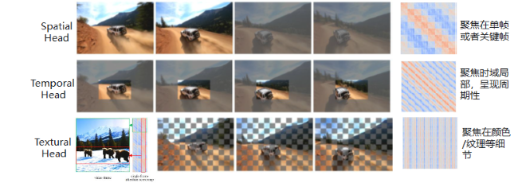
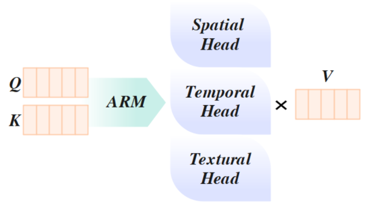

# 稀疏

RainFusion作为稀疏方法，主要基于视频本身具有的时空相似性，对Attention进行自适应判断和稀疏计算，可以有效减少计算开销，提高推理速度。

其核心原理如下：

- 离线特征挖掘： DiT扩散生成的Attention存在时空特征上的冗余，可以将Attention head 分为三种稀疏类型，对应三种静态Attention Mask

     

     - Spatial head：关注当前帧或关键帧内的全部token，聚焦单帧的空间一致性。
     - Temporal head：关注多帧内相同局部区域之间的相关性，聚焦长序列中的周期性稀疏性的表现。
     - Textural head：关注high level 语义信息与输入相关的细节，聚焦语义一致性。

- 在线判定：引入轻量化在线判别模块ARM（如图所示），在线判定每个 Head 的稀疏类型

    
